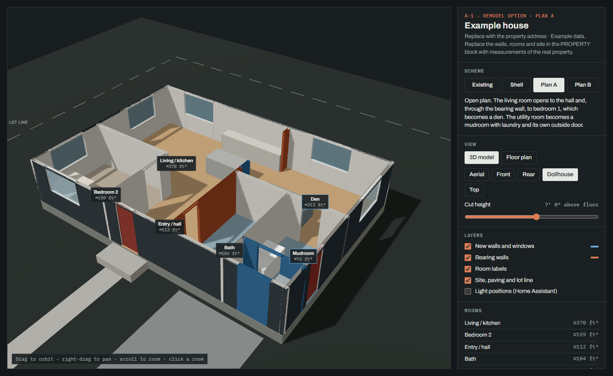
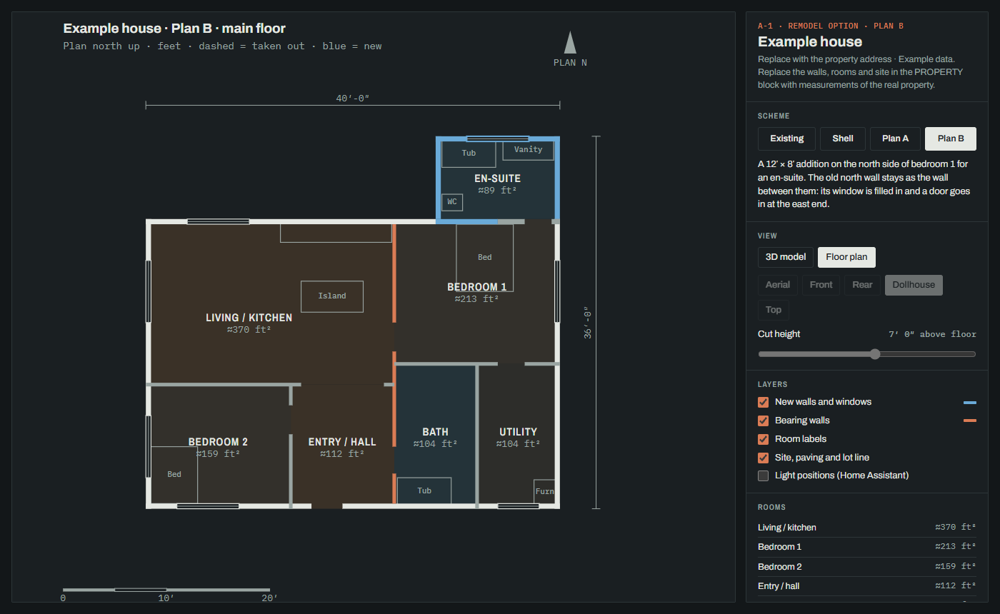

# 3D Home Model Creator

A 3D model and floor plan of a house, built from one block of data in one HTML file. Draw remodel options against it, and the page works out what each one builds, fills in and takes out. The same data also exports to a GLB for Home Assistant's [floor3d-card](https://github.com/adizanni/floor3d-card).

**[Live demo](https://nathanloehlein.github.io/3d-home-model-creator/)** (an example house with three remodel options)




## Features

- **One file, nothing to install.** `model.html` holds the data and the renderer. three.js loads from a CDN. The tooling is plain Node with no dependencies.
- **3D model**: orbit, camera presets and a cut-height slider for seeing inside. Click a room to see its size, level and ceiling. Gable, hip and shed roof planes and sloped ceilings use the same property data.
- **Floor plan**: rectangular or polygon rooms, diagonal walls, door swings, fixtures, windows, overall dimensions, north arrows and a scale bar, with one plan per floor.
- **Remodel schemes**: list only what changes, and the page compares it with the house as it stands.
  - New walls and filled-in openings are blue.
  - Walls taken out are dashed.
  - Bearing walls are rust.
  - A built-in Shell option shows the house with every inside wall gone.
- **Room areas** are estimated from the wall lines, or you enter a measured figure.
- **Home Assistant**: a GLB with named objects for floor3d-card, and a script that pushes the dashboard.
- Light and dark themes; works on a phone.

## Quick start

Needs Node 20 or later.

```bash
git clone https://github.com/nathanloehlein/3d-home-model-creator.git my-house
cd my-house
npm start
```

Open http://localhost:8767/, then edit the DATA block in `model.html` and reload.

### Start with an AI coding agent

Open the cloned folder in your preferred AI coding tool, attach whatever property material you have, and use a prompt like this:

```text
Use this repository to create an accurate 3D model and floor plan of my home.

Read README.md and CLAUDE.md first. Replace the example PROPERTY data in
model.html with my house. Preserve the existing renderer and tools. Use feet as
the model unit, plan north up, x east, and z south.

Source material attached:
- [list each floor plan, survey, sketch, photo set, or measurement sheet]

Start by inventorying the source material and summarizing:
1. dimensions and facts you can verify;
2. conflicts or ambiguous details;
3. measurements still needed;
4. proposed coordinate origin and wall outline.

Do not guess missing dimensions silently. Clearly label estimates. Prefer written
measurements over proportions inferred from drawings or photos. Build the existing
house first and verify it in both 2D and 3D before adding remodel schemes.

Existing house details:
- Address or project name: [optional]
- Floors and level changes: [example: main floor plus garage 7 inches lower]
- Ceiling heights/slopes: [example: 8 feet flat; living room vaulted to 12 feet]
- Known bearing walls: [list, or say unknown]
- True-north direction relative to the plan: [if known]

Remodel goals, after the existing model is correct:
- [goal 1]
- [goal 2]
- [fixed constraints or things that cannot move]

Run npm test and npm run build when finished. Show me the rendered floor plan and
3D model, then list every estimate or unresolved question.
```

Useful source material, from best evidence to supporting context:

- **Dimensioned floor plans:** architect drawings, appraisal plans, listing plans or a hand sketch. Include every floor and note which direction is north.
- **Boundary or topographic survey:** lot lines, building footprint, setbacks, patios, decks, driveways, detached structures and true north. A vector PDF is especially useful.
- **Measurement sheet:** exterior wall runs first, then room dimensions, wall thicknesses, door/window widths and offsets from a known corner.
- **Exterior photos:** one straight-on photo of every side, plus oblique corner views showing roof shapes, grade changes, decks and additions.
- **Interior photos:** each room from opposing corners; include doors, windows, stairs, ceiling transitions and connections to adjacent rooms.
- **Ceiling and level notes:** floor-to-ceiling heights, vaulted high/low points, steps, sunken rooms and garage slab offsets.
- **Utility and structure notes:** known bearing walls, posts, beams, plumbing stacks, electrical panels, HVAC equipment and immovable appliances.
- **Remodel markups:** a sketch or annotated plan showing desired additions, removed walls, new openings and fixed constraints.

Screenshots and phone photos work. PDFs or original exports usually preserve more detail. Crop unrelated personal information before attaching documents or publishing your finished model.

| Command | What it does |
|---|---|
| `npm start` | Preview server at http://localhost:8767/. It rebuilds the page on every request. |
| `npm run build` | Writes `_site/index.html`, a standalone page. |
| `npm run glb` | Writes `ha/house.glb` for Home Assistant. |
| `npm test` | Tests the scheme diff. |

The URL hash opens a scheme and a view directly, e.g. `#plan-a` or `#plan-b/plan`.

## Modelling your property

Everything about the property lives in `model.html`, between `/* DATA:BEGIN */` and `/* DATA:END */`. The example house there is meant to be replaced.

Measuring tips:

- Take the exterior dimensions first, since they set the frame, and close the loop around the outside.
- Then measure each room wall to wall, and the window and door offsets from a corner.
- A survey, an assessor's sketch or a listing floor plan makes a good starting point.

### Coordinates

Everything is in plan feet with plan north up. Pick any corner of the house as 0,0; the north-west outer corner is easiest.

- x = plan east, z = plan south.
- y = feet above the main floor. `LV.grade` is the ground, usually −1 to −2 ft.
- `PROPERTY.trueNorth` is how many degrees true north sits clockwise from plan north. It draws the TRUE N arrow.

### Exterior walls (`ext`)

Each wall is `{ x0, z0, x1, z1, out, open }`, drawn from its first endpoint to its second endpoint along the outside face. Endpoints can run in any direction.

- For axis-aligned walls, `out` keeps its original convention: −1 means toward −x or −z, and 1 means toward +x or +z.
- For diagonal walls, `out: 1` is the right side when walking from `(x0, z0)` to `(x1, z1)`; `out: -1` is the left. Exterior wall thickness is built on the opposite side.
- `t` sets the thickness. The default is 0.5 ft for exterior walls and 0.35 ft for interior walls.
- `top` sets the wall's height (default `WALL_H`). It can be `(x, z) => height` for a sloped or gable wall top.

### Interior walls (`parts`)

These take the same fields as exterior walls, without `out`. They're drawn on their centerline.

- `bearing: true` marks a wall that carries the roof or floor above. It's drawn in rust, and when a scheme takes it out the dashed line stays rust, meaning it needs a beam or posts.
- `id` is optional on any wall, room or fixture. It lets a scheme `revise()` that item.
- Stop interior walls at the inside face of the outside walls; one that runs to the outer line shows through the siding.

### Openings (`open`)

Openings run from `a` to `b`. On axis-aligned walls these remain the global x or z coordinates used by earlier versions. On diagonal walls they are distances in feet from the wall's first endpoint.

| Helper | What it draws |
|---|---|
| `WIN(a, b, sill, head)` | A window |
| `DOOR(a, b, head?, options?)` | A solid door with an optional plan swing |
| `OPEN(a, b)` | A gap with a header above it |
| `GDOOR(a, b)` | A garage door, 7′ high |

Door options are `{ hinge: 'a' | 'b', swing: 1 | -1 | 0 }`. The default is `{ hinge: 'a', swing: 1 }`; use `swing: -1` for the opposite side or `swing: 0` to hide the swing. If the default 6.8′ head is fine, pass options as the third argument: `DOOR(2, 5, { hinge: 'b', swing: -1 })`.

### Levels and floor plans

- `LV` holds the floor heights, e.g. `{ main: 0, garage: -0.6, upper: 9.5, grade: -1.5 }`.
- Walls, rooms and fixtures take `lvl` (default `main`).
- A wall's base is its level, and its default top is the base plus `WALL_H`.
- `PLANS` lists the 2D plans and which levels each one shows, e.g. `{ main: { name: 'Main floor', lvls: ['main', 'garage'] }, upper: { name: 'Upper floor', lvls: ['upper'] } }`.
  - The floor switch appears when there's more than one plan.
  - The other plans' outside walls are drawn dashed.

### Rooms (`rooms`)

Each room is `{ id, name, lvl, mat, rects: [[x0, z0, x1, z1], …], at: [x, z] }`. For non-rectangular floors, use `poly: [[x, z], …]` or `polys: [[[x, z], …], …]` instead of `rects`.

- `rects` are wall centerlines. The page subtracts a wall allowance to get the floor area. Polygon area uses the supplied outline. Give `area` instead if you have a measured figure.
- `mat` picks the floor colour: woodMain, carpet, tile, wet, closet, mech or conc.
- `at` places the label. A room without one, such as a closet, gets no label and stays out of the room list.
- `ceilH` (a height) or `ceil` (a description) describes the ceiling. `sub` and `note` add lines to the selected-room panel.
- `ceilings: [PLANE([[x, z, height], …], thickness)]` draws one or more sloped ceiling planes. Heights are relative to that room's level.

### Everything else

- `fixtures` are made with `fx(label, [x0, z0, x1, z1], height, material, base, extra)`. Put `{ fixed: true }` in `extra` for things that stay put in any remodel (furnace, panel, meters); the Shell keeps only those.
- `foundation`, `roofs` and the `site` (ground, lot polygon, paving pads, labels) are optional.
- A roof may use the legacy flat form `{ r: [x0, z0, x1, z1], top, th }` or a plane: `PLANE([[x, z, absoluteHeight], …], thickness)`. Combine planes for gable or hip roofs; one tilted plane makes a shed roof.
- `facts` and `notes` fill the sidebar.
- `lights` are the Home Assistant light positions: `[name, x, z, height]`.

## Remodel schemes

Remodel options live in `SCHEMES`, right after `PROPERTY` in the DATA block. Without any, the page is just the existing house. With some, a Scheme switcher appears: **Existing**, then each scheme in order.

```js
const SCHEMES = {
  shell: { name: 'Shell', shell: true },
  'plan-a': {
    name: 'Plan A',
    summary: 'One or two sentences on the idea.',
    parts: [
      ...revise(PROPERTY.parts, { 'living-s': { x1: 14, open: [] }, 'old-closet': null }),
      { id: 'new-wall', x0: 32, z0: 24, x1: 40, z1: 24, open: [OPEN(34, 37)] },
    ],
    rooms: [...revise(PROPERTY.rooms, { 'bed-1': null }), { id: 'den', name: 'Den', sub: 'was bedroom 1', /* … */ }],
    scope: ['Work involved, one line per item.'],
    checks: ['Open questions: engineer, permits, budget.'],
  },
};
```

- **Inheritance.** A scheme replaces only the lists it names: `ext`, `parts`, `rooms`, `fixtures`, `foundation`, `roofs`, `dims`. Everything else is the existing house. The site and the Home Assistant lights are shared by every scheme.
- **`revise(list, edits)`** copies an existing list by `id`. `{ id: null }` drops that item and `{ id: { ...fields } }` changes some of its fields. Spread it and add new items after it.
- **New work is worked out, not tagged.** Each scheme's walls are compared with the existing ones:
  - Blue: wall where there was none, and old openings that are now filled in. In the plan, a window that wasn't there before gets a blue outline.
  - Dashed: wall stretches the scheme takes out. Rust dashes mean the wall was bearing.
  - Two walls are the same wall when they run the same way on the same level and their thicknesses overlap. So an old outside wall kept as an inside wall in an addition can move into `parts` and still match. Plan B in the example does this.
  - `isNew: true` on a wall or opening forces it to count as new. A room counts as new when its `id`, footprint or ceiling planes changed; `isNew` on a room overrides that.
- **Shell.** `shell: true` starts from the house with every inside wall gone. It keeps only `fixed` fixtures, and has one room per level that keeps each old room's ceiling height.
- **Additions.** Change `ext`, and add the new footprint to `foundation` and `roofs`. The 2D frame fits every scheme, so plans line up when you switch.
- **`existing` is a reserved id.**
- **Once a scheme is built**, move its lists into `PROPERTY`. It is now the house as it stands.

The diff lives in the SCHEME block of `model.html` and needs only the DATA and WALLS blocks, so the Node tools can evaluate it too. `npm test` covers it.

## Home Assistant 3D

1. Run `npm run glb` to write `ha/house.glb`.
   - It contains these objects: `walls_exterior`, `walls_interior`, `windows`, `doors`, `foundation`, `furniture`, `paving`, `lot`, `room_<id>`, and one `light_<…>` disc per entry in `PROPERTY.lights`.
   - Units are cm and Y is up. The north-west corner of everything is the origin, which is what floor3d-card expects.
   - `node tools/ha_floor3d.mjs --scheme plan-a` exports a scheme to `ha/house-plan-a.glb` instead, without the new-work colouring.
   - `npm start`, then http://localhost:8767/ha/_view.html, checks that the GLB loads.
2. In Home Assistant, install floor3d-card from HACS (adizanni/floor3d-card).
3. Copy `ha/house.glb` to `/config/www/property3d/house.glb`. It's served as `/local/property3d/house.glb`. The folder name must match `path` in `ha/dashboard.yaml`.
4. Edit `ha/dashboard.yaml` and replace the placeholder entity ids, one binding per light disc.
5. Put `HA_URL=…` and `HA_TOKEN=…` (a long-lived access token) in `.env`, which git ignores. Then push the dashboard:

   ```bash
   pip install websockets pyyaml
   python tools/ha_push_dashboard.py --env .env --url-path property-3d --title "Property 3D"
   ```

A single click on a disc toggles its entity, and a drag orbits. Lights render with their HA colour and brightness.

## Publishing

- **GitHub Pages.** `.github/workflows/pages.yml` tests, builds and deploys the page on every push to `main`. Turn it on under *Settings → Pages → Source: GitHub Actions*. Remember that the published page shows your house's layout.
- **Claude Artifacts.** `model.html` is a body fragment, with no `<html>` or `<head>`, so it can be published as a [Claude](https://claude.ai) Artifact as it is. `npm run build` adds the document skeleton for everywhere else.

## Working with Claude Code

`CLAUDE.md` holds the model's rules, so [Claude Code](https://claude.com/claude-code) can do the data entry. Hand it measurements, a survey or listing floor plans, and ask it to fill in the DATA block or draft a remodel scheme.

## Project layout

```
model.html               the page: data (DATA block), wall builder (WALLS), scheme diff (SCHEME), renderer
tools/serve.mjs          preview server
tools/build.mjs          model.html -> _site/index.html
tools/ha_floor3d.mjs     model.html -> ha/house.glb
tools/scheme.test.mjs    tests for the scheme diff
tools/ha_push_dashboard.py  pushes ha/dashboard.yaml to Home Assistant
ha/dashboard.yaml        floor3d-card dashboard with placeholder entities
ha/_view.html            standalone check that ha/house.glb loads
reference/               for your measurements, survey and photos
```

## Geometry notes

- Floor polygons should be simple outlines without holes. Use `polys` to split disconnected or complex floor areas into simpler pieces.
- Roof and ceiling surfaces are planar. Curved roofs require several approximating planes.
- The GLB exporter triangulates polygon faces as a fan, so split concave room footprints into convex polygons with `polys` for reliable Home Assistant output.

## License

[MIT](LICENSE)
